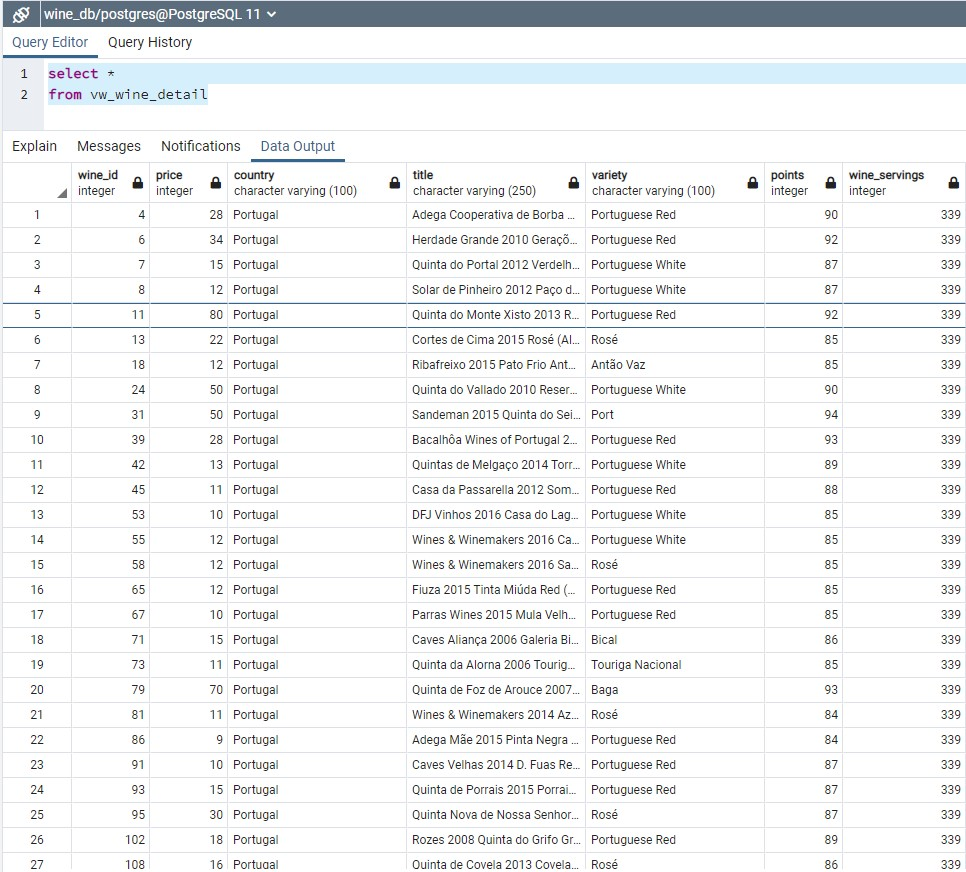

## Final Report

Project 2: ETL Challenge

This project was completed by Arianne, Samantha, and Kimberly.

#### Background
We built this database for our client to be able to analyze wine reviews in relation to the country of origin. They also requested to look at the varieties in terms of highest ratings and alcohol consumption by country.
In order to make sure their investment is profitable, they wanted to look at wine consumption in relation to country as well as price.
- We chose to use SQL in order to utilize a structured database.

We used [quickdatabasediagrams.com](https://www.quickdatabasediagrams.com) to put together our schemata
 

### Extract: The first thing we did was import our data into our Jupyter notebook. These can be found in the Resources folder:
1. winemag-data-130k-v2.json - [source: kaggle.com](https://www.kaggle.com/zynicide/wine-reviews)
2. alcohol_consumption.csv - [source: kaggle.com](https://www.kaggle.com/codebreaker619/alcohol-comsumption-around-the-world)

### Transform: Next we used pandas to clean and transform our data

1. Wine Reviews:
- used json resource to create our wine review DataFrame
- created clean_wine DataFrame by choosing the columns we wanted
- replaced "US" with "USA" in the country column so that we didn't get extra information when merging our two resources
- dropped any duplicate rows 
- dropped all NaN values

2. Alcohol Consumption:
- used pandas to read our csv 
- pulled the columns we wanted to use
- this one did not have any duplicates or NaN values

3. Merged DataFrames
- merged our DataFrames using an inner join on country 
- added wine_id to be used as the primary key for our wine table that held the combined data
- the normalized data referenced wine_id as a foreign key 

### Load: We used pandas to load our data into the blank tables created in pgAdmin
* After all the tables were populated, we created a view to look at all the data together. 

* See [Pictures](Pictures) for more table screenshots.
* Reference our SQL database [here](SQL)
